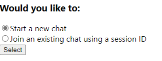
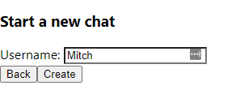
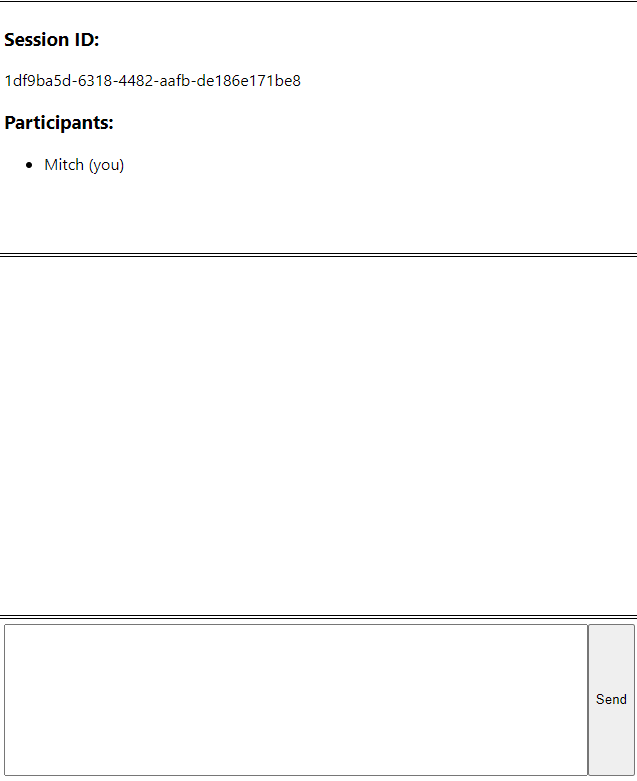
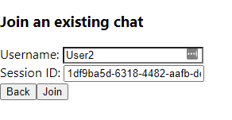
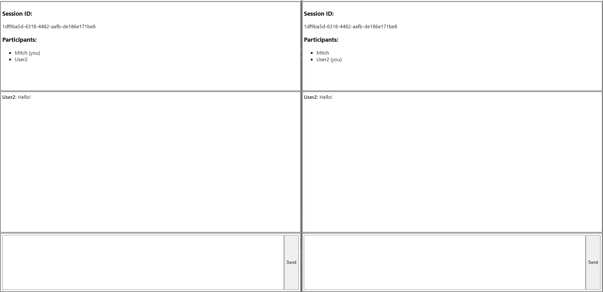

# ChatApp

## Description

This application is a simple implementation of a session-based real-time chat application using websockets.

The frontend was written with `React` and `TypeScript`, the backend was created using `node` with the help of `express` (a WebServer library), and `ws` (a WebSockets library)

## Prerequisites

In order to run this application you will need `npm` installed on your machine. Tested with npm versions `6.14.12` and `7.7.6`

## How to run

The ChatApp application is divided into two `npm` packages that have both been included in this same git repository for convenience - one for the client, and one for the server.

These packages are located at `{REPOSITORY_ROOT}/client` and `{REPOSITORY_ROOT}/server` respectively.

In order for the application to be fully functional both the client and the server will need to be running on your machine.

### Server

To run the server first navigate to the `server` package's directory, and run the following commands in your terminal:

```bash
# This will install the server's dependencies
npm install;

# Once the previous step completes run the following command to create a build folder with the built project
npm run build;

# This will spin up a local web server on port 8000
npm run start;
```

At this point the server application should be listening to requests on port `8000`.

### Client

Once the server is up and running the client can be started in the following way.

First, navigate to the `client` directory, then run the following

```
# Install the dependencies of the client package
npm install;

# This will spin up another local webserver to vend the build artifacts of the client.
npm run start;
```

At this point the script should open your default browser to the chat application client, but in the event that it does not, the client will be running on `http://localhost:3000//` and can be accessed by typing that URL into your web browser.

## Usage

Once started, the application will give you the choice to either start a new chat, or to join an existing chat session. To start, select the `Start a new chat` option and hit select



At this point you will be taken to a screen where it will ask you to input a username. Enter a name to be used as your display name and hit "Continue"



You will now be directed to the main chat screen. Take note of the `Session ID` listed in the top left corner of the screen, as this is what you will provide to other users who would like to join your session.



At this point open a new tab or a new browser window and navigate to `localhost:3000` again.

This time, select the "Join an existing chat using a session ID" option from the menu. When you hit select this time, you will be taken to a screen that allows you to enter a session ID along with your desired username. Use the Session ID from the open chat window from the previous step to join the same chat session.



Upon selecting join you will end up in a similar screen as the first time. You should now see that both users are displayed in both windows, and that chats typed into the chat area at the bottom of the screen are displayed to both users as well.



Happy chatting!
